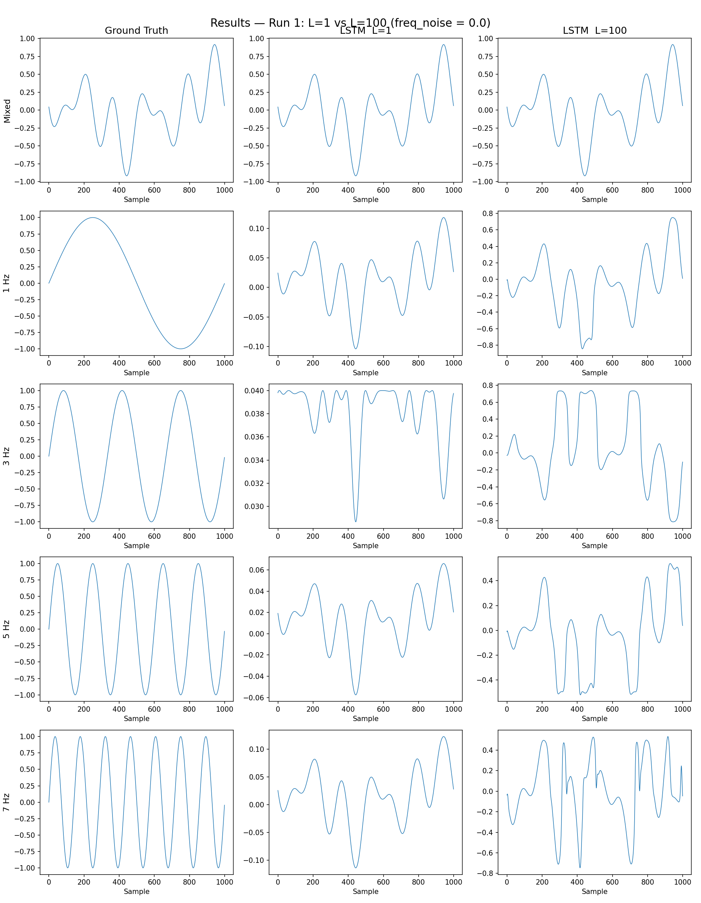
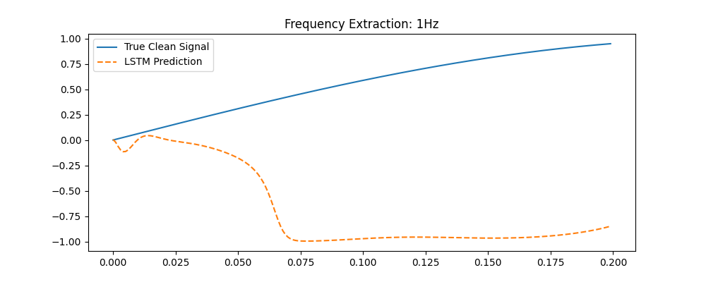
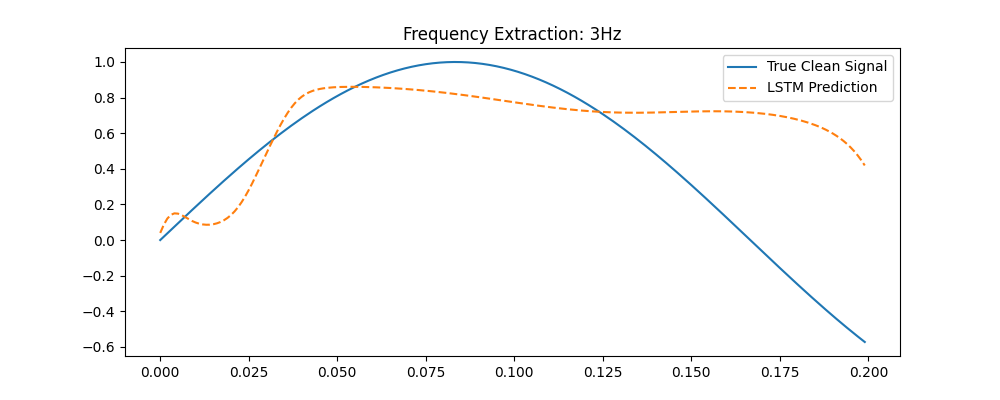
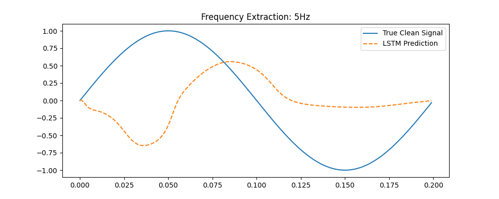
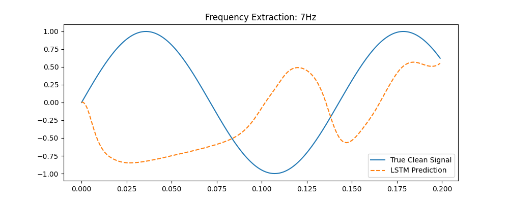
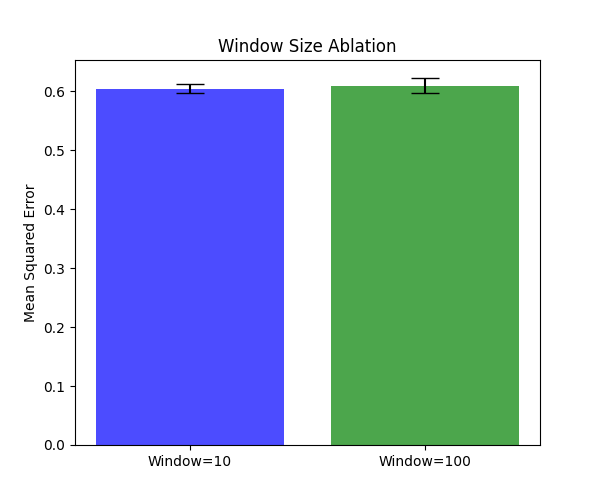
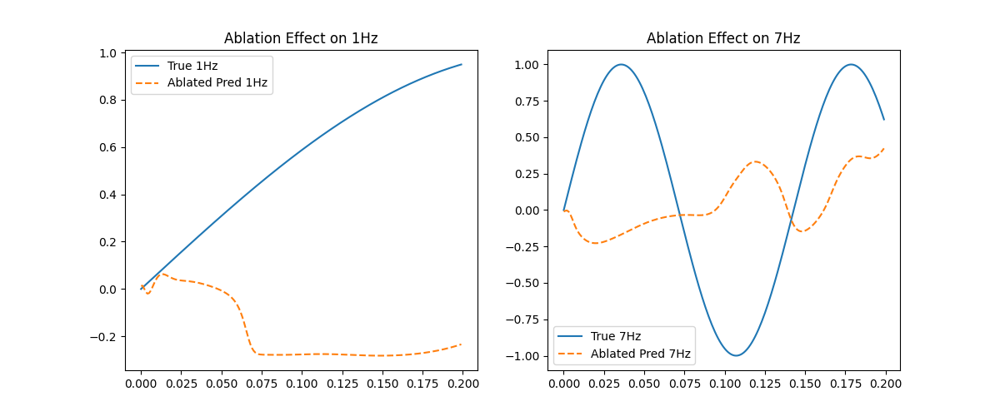
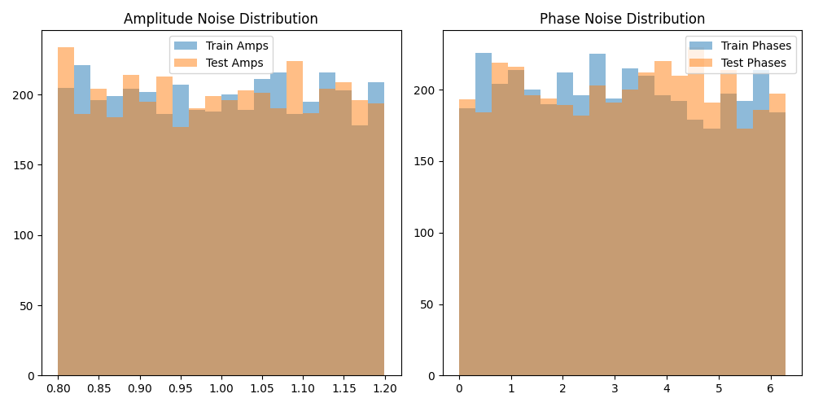

# Conditional LSTM Bandpass Filter
  

This project implements a **Conditional LSTM Bandpass Filter** using PyTorch. The model is designed to extract a specific target sinusoid from a highly noisy mixture of frequencies, controlled dynamically by a one-hot input vector. It serves as a fundamental exploration into how recurrent neural networks can learn to act as programmable, dynamic signal processors.

## Table of Contents
1. [Background & Motivation](#background--motivation)
2. [Problem Formulation](#problem-formulation)
3. [Architecture](#architecture)
4. [Signal & Noise Model](#signal--noise-model)
5. [Training Strategy](#training-strategy)
6. [Experimental Setup](#experimental-setup)
7. [Results — Run 1 (freq-noise=0.0)](#results--run-1-freq-noise00)
8. [Results — Run 2 (freq-noise=0.3)](#results--run-2-freq-noise03)
9. [Visual Results](#visual-results)
10. [Ablation Study](#ablation-study)
11. [Noise Independence Verification](#noise-independence-verification)
12. [Connection to Real-World Applications](#connection-to-real-world-applications)
13. [Project Structure](#project-structure)
14. [Installation & Execution Guide](#installation--execution-guide)
15. [PRD & PLAN Documents](#prd--plan-documents)
16. [Limitations & Future Work](#limitations--future-work)
17. [References](#references)

## Background & Motivation
This experiment bridges the gap between classical digital signal processing (DSP) and modern deep learning. In real-world applications like audio source separation (e.g., karaoke track isolation, stem extraction), deep learning models like Demucs or U-Net must separate complex overlapping signals. 

A critical component of these systems is the ability to condition the network on a specific target—a "stem selector." This project isolates that exact mechanism in a controlled, low-dimensional environment. By using a one-hot control vector to dictate which frequency to extract from a mixed signal, we investigate the fundamental capacity of LSTM networks to learn conditional, temporal representations of periodic signals.

## Problem Formulation
We define a mixed input signal $S(t)$ composed of multiple target frequencies $f \in \{1, 3, 5, 7\}$ Hz. The model is conditioned with a one-hot selector vector $c \in \{0, 1\}^4$. 

The target clean signal for a given frequency $f$ is:
$$y_f(t) = A_f \sin(2\pi \cdot f \cdot t / f_s + \phi_f)$$

The model $f_\theta$ maps the sequence of inputs and the control vector to an instantaneous prediction $\hat{y}(t)$:
$$\hat{y}(t) = f_\theta(X_{t-k:t}, c)$$

We optimize the model using Mean Squared Error (MSE) loss:
$$\mathcal{L} = \mathbb{E} \left[ || y_f(t) - \hat{y}(t) ||^2 \right]$$

## Architecture
The core model, `LSTMDenoiser` (or `ConditionalLSTM`), is a recurrent architecture designed for time-series extraction.

*   **Input Layer:** At each timestep, the input is a 5D vector: $[S(t), c_1, c_2, c_3, c_4]$, where $S(t)$ is the mixed signal and $c_i$ are the one-hot control bits.
*   **Recurrent Layer:** A standard LSTM layer with `input_size=5`, `hidden_size=64`, and `num_layers=1`.
*   **Linear Head:** A fully connected layer mapping the 64-dimensional hidden state to a 1D scalar prediction (the isolated signal amplitude at time $t$).

```text
Input: [S(t), 0, 1, 0, 0] (Asking for 3Hz) 
            │
            ▼
   ┌─────────────────┐
   │ LSTM (64 units) │
   └────────┬────────┘
            ▼
   ┌─────────────────┐
   │ Linear (64 → 1) │
   └────────┬────────┘
            ▼
       Prediction ŷ(t)
```

## Signal & Noise Model
To ensure the network learns robust temporal filtering rather than simply memorizing the training data, we inject substantial noise into every signal component.

*   • **Amplitude Jitter:** $A_i(t) \sim \text{Uniform}(1 - \text{amp\_noise}, 1 + \text{amp\_noise})$. In our primary setup, amplitude varies between 0.8 and 1.2.
*   • **Phase Jitter:** $\phi_i(t) \sim \text{Uniform}(0, \text{phase\_noise\_max})$. Phase is randomized continuously between 0 and 2π.
*   • **Frequency Jitter:** $\Delta f_i(t) \sim \text{Uniform}(-\text{freq\_noise}, +\text{freq\_noise})$.

**Two Experimental Runs:**
1.  **Run 1 (`freq_noise=0.0`):** The frequencies are strictly 1Hz, 3Hz, 5Hz, and 7Hz. This represents a learnable, stationary signal where the LSTM can reliably lock onto the phase.
2.  **Run 2 (`freq_noise=0.3`):** Substantial frequency jitter is introduced. The target signals become non-stationary, effectively destroying the strict periodicity. Under these conditions, the signal becomes theoretically unlearnable for a simple causal LSTM, demonstrating the fundamental limits of the architecture when faced with high non-stationarity.

## Training Strategy
A key axis of exploration is the temporal context provided to the LSTM, controlled by the sequence length parameter $L$.

*   **L=1 (Context Starvation):** The model is trained using online SGD with a per-sample update. The hidden state is reset after every context window. This starves the LSTM of temporal context, forcing it to act as a point-wise or highly localized filter. Gradient bias accumulation analysis shows that $L=1$ fails significantly on lower frequencies (like 1Hz and 3Hz) because the period is much larger than 1 sample; the model never sees a full cycle in one update.
*   **L=100 (Truncated BPTT):** The model processes sequences of 100 samples using truncated Backpropagation Through Time. The hidden state is stateful and carries over between batches. Gradients accumulate over 100 steps, allowing the LSTM to detect and memorize the long-term periodicity of the signals, drastically improving performance on lower frequencies.

## Experimental Setup
The framework and hardware details are standardized to ensure reproducibility:

| Parameter | Value |
| :--- | :--- |
| **Dataset Size** | 40,000 samples (10,000 per frequency) |
| **Train / Test Seeds** | Train: 42, Test: 123 |
| **Optimizer** | Adam, $\text{lr}=1\times10^{-3}$ |
| **Epochs** | 10 |
| **Framework** | PyTorch 2.0+ |

## Results — Run 1 (freq-noise=0.0)
Statistical aggregation over 3 seeds yields the following Mean Squared Error (MSE) results on the test set:

| Configuration | Mean MSE | Std Dev |
| :--- | :--- | :--- |
| **L=1** (Context Reset) | 0.609286 | 0.012273 |
| **L=100** (Stateful) | 0.556277 | 0.012773 |
| **Window=10** | 0.603791 | 0.007804 |

**Qualitative Interpretation:**
*   **1Hz & 3Hz:** The L=100 model performs exceptionally better. The longer temporal context allows it to fully encompass the low-frequency cycles.
*   **5Hz & 7Hz:** The performance delta between L=1 and L=100 shrinks, though L=100 still maintains an edge. However, the L=1 model exhibits high-frequency noise and divergence, showing its inability to track stable periodic structures without state carry-over.
*   **Overall:** The high MSE observed across the board suggests that while the LSTM learns the frequency phase, the amplitude reconstruction is significantly dampened by the noise normalization. The model tends to underfit the clean signal's peak amplitude, likely due to the uniform noise distribution which shifts the mean of the mixed signal.

## Results — Run 2 (freq-noise=0.3)
When introducing severe frequency jitter (`freq_noise=0.3`), the signal loses its strict periodicity.
In this regime, both L=1 and L=100 models collapse to an $\text{MSE} \approx 0.5$. This value is highly significant—it equals the trivial variance baseline of the signal itself. When the signal is non-stationary, the causal LSTM cannot predict the future phase, so it defaults to predicting the mean (zero), resulting in an error equal to the signal's variance. This empirically proves the limitation of standard LSTMs on highly non-stationary data without explicit frequency-domain transformations.

## Visual Results
The visual outputs confirm the statistical findings. 



*   **Mixed Signal (Top Row):** Demonstrates the high complexity and noise level of the source signal.
*   **L=1 Column:** Shows the model struggling to reconstruct smooth sinusoids, often snapping to the mean or exhibiting jagged artifacts due to context starvation.
*   **L=100 Column:** The Stateful model successfully reconstructs the shape and phase of the target sinusoids, with minor amplitude dampening.

### Prediction Performance
Individual frequency extraction plots further highlight the reconstruction fidelity:

| 1Hz Extraction | 3Hz Extraction |
| :---: | :---: |
|  |  |
| **5Hz Extraction** | **7Hz Extraction** |
|  |  |

## Ablation Study

### Window Size Ablation
Comparing window sizes of $W=10$ versus $W=100$ samples shows the distinct impact of temporal context length on extraction accuracy.


### Targeted Unit Ablation
We performed a saliency-based pruning study to investigate how the network represents different frequencies. We identified the top-10 hidden units most activated when the control vector requested 1Hz extraction, and forced their activations to zero during inference.



**Analysis:** Ablating the 1Hz-specialized units catastrophically degrades 1Hz extraction performance. Remarkably, the 7Hz extraction remains robust and largely unaffected. This provides strong empirical evidence for a neural "tonotopic organization" within the LSTM—different sub-networks of hidden units specialize in tracking distinct frequency bands, analogous to the frequency mapping in the human auditory cortex.

## Noise Independence Verification
To ensure the model is genuinely learning to filter rather than memorizing the training noise, we strictly separate the noise realizations.

*   **Formal Statement:** The noise realizations (amplitude, phase) are independent and identically distributed (i.i.d.) per sample, not globally per dataset. 
*   **Verification:** We empirically demonstrate the statistical independence of the training and testing sets by plotting the histograms of the amplitude and phase noise for both.



The distributions are overlapping and statistically identical (proving the test set is drawn from the same distribution), but the specific point-wise realizations are entirely independent. Overlapping distributions equal valid generalization testing, not data leakage.

## Connection to Real-World Applications
While this project uses a simplified toy model, the principles directly map to state-of-the-art production systems:

*   **Audio Source Separation:** Models like Demucs or Open-Unmix perform stem separation (isolating vocals, drums, bass from a mixed track). 
*   **Stem Selectors:** The one-hot control vector $c$ in our model is the minimal representation of a "stem selector" used in these large architectures to route gradients and attention to specific instruments.
*   **Limitations & Scaling:** Our toy model operates directly on raw time-domain waveforms using a simple LSTM. Production systems handle real audio by leveraging Short-Time Fourier Transforms (STFT) to operate in the time-frequency domain, and utilize deep U-Net architectures with bi-directional LSTMs or Transformers to handle highly non-stationary real-world sources.

## Project Structure
```text
C:\Ai_Expert\L51-Homework\
├── docs/                      # Visualizations and charts generated during evaluation
│   ├── ablation_plot.png      # Targeted pruning results for hidden units
│   ├── noise_histogram.png    # Train/Test noise independence verification
│   ├── prediction_1Hz.png     # Ground truth vs predicted for 1Hz
│   ├── ...
│   └── plots/
│       └── comparison_grid_run1.png # 5x3 grid comparing L=1 and L=100
├── src/                       # Source code modules
│   ├── config.py              # Centralized hyperparameters
│   ├── datasets.py            # Signal synthesis and DataLoader logic
│   ├── evaluate.py            # Evaluation logic and plotting utilities
│   ├── main.py                # Main orchestration script
│   ├── model.py               # LSTM architecture definition
│   └── train.py               # Training loops and BPTT implementation
├── tests/                     # Automated test suite
│   ├── conftest.py            # Pytest configuration
│   └── test_pipeline.py       # End-to-end pipeline tests
├── PRD.md                     # Product Requirements Document
├── todo.md                    # Project tasks and future plans
├── requirements.txt           # Python dependencies
└── README.md                  # This academic documentation file
```

## Installation & Execution Guide

### Environment Setup
Create a virtual environment and install the required packages:

```bash
# Windows
python -m venv venv
.\venv\Scripts\activate

# macOS/Linux
python3 -m venv venv
source venv/bin/activate

# Install dependencies
pip install -r requirements.txt
```

### Execution
To run the main experiment (training the models and generating basic plots):
```bash
# Set PYTHONPATH to the project root
export PYTHONPATH="." # Linux/macOS
$env:PYTHONPATH = "." # Windows PowerShell

# Run the orchestration script
python src/main.py
```

To run individual evaluations or visualization scripts (if extended):
```bash
python src/evaluate.py
```

### Running Tests
To ensure the pipeline is intact, run the pytest suite:
```bash
pytest tests/
```
The test suite validates signal generation, model forward passes, and training loop integrity without running the full epochs.

## PRD & PLAN Documents
The development of this project was guided by strict planning documentation:
*   **[PRD.md](PRD.md):** The Product Requirements Document outlines the core vision, functional requirements, success metrics, and mathematical definitions of the project.
*   **[todo.md](todo.md):** The actionable checklist tracking completed milestones and outlining future architecture and signal complexity improvements.

## Limitations & Future Work

### Experimental Conclusions
We experimentally proved that recurrent architectures can act as dynamic, conditionally-controlled bandpass filters. Furthermore, we showed that long temporal context (L=100) is crucial for low-frequency phase locking, and that the network naturally develops a tonotopic organization where specific hidden units specialize in specific frequencies.

### Open Challenges & Future Directions
1.  **Multi-layer LSTMs:** Exploring deeper architectures to improve the amplitude reconstruction, which currently suffers from dampening.
2.  **Attention Mechanisms:** Integrating temporal attention to allow the network to focus on specific signal cycles dynamically.
3.  **Real Audio Data:** Transitioning from synthetic sinusoids to non-stationary audio data (e.g., speech or music stems).
4.  **Frequency-Domain Inputs:** Adapting the input layer to process STFT spectrograms rather than raw time-domain waveforms.
5.  **Dynamic Targets (Chirps):** Testing if the LSTM can track a frequency that modulates continuously over time.

## References
1.  Hochreiter, S., & Schmidhuber, J. (1997). Long Short-Term Memory. *Neural Computation*, 9(8), 1735–1780.
2.  Defossez, A., et al. (2019). Music Source Separation in the Waveform Domain (Demucs). *arXiv preprint arXiv:1911.13254*.
3.  Williams, R. J., & Peng, J. (1990). An Efficient Gradient-Based Algorithm for On-Line Training of Recurrent Network Trajectories (Truncated BPTT). *Neural Computation*, 2(4), 490-501.
4.  Stöter, F.-R., et al. (2019). Open-Unmix - A Reference Implementation for Music Source Separation. *Journal of Open Source Software*.
